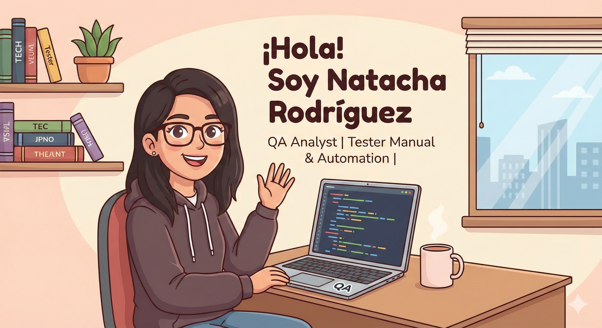

  

---
### 👩‍💻 Sobre mí

¡Bienvenido a mi portafolio profesional. Aquí comparto mis proyectos, aprendizajes y recursos sobre el apasionante mundo del Testing.

Soy QA Analyst y funcional 

Mi carrera inició en la **Ingeniería Química** :bar_chart:, guiada por el deseo de entender cómo funcionan las cosas. Siempre he sido una persona analítica, de las que miran dos veces donde otros solo ven una, lo cual resultó ser una ventaja clave en el mundo de la tecnología.

Descubrí mi vocación en el área de **Calidad (QA)** :mag:. Siento una satisfacción casi personal al detectar defectos y corregirlos; es esa sensación de paz que queda cuando terminas de ordenar tu casa y admiras el resultado. Para mí, la calidad es un hábito que disfruto practicar.

Entender la **Mejora Continua** :arrows_counterclockwise: cambió mi perspectiva: aprendí que el objetivo es aportar valor incremental y adaptarnos a la visión del usuario. El Testing me permite unir todo esto: desglosar proyectos complejos en pasos manejables y asegurar que, al final del día, el resultado sea impecable.

Más allá de la ejecución de pruebas y habilidades técnicas, me destaco por mi liderazgo natural y comunicación asertiva. Disfruto motivando a mis compañeros y transformando problemas complejos en soluciones creativas.

Me mantengo en formación continua sobre las últimas tendencias IT y busco sumarme a equipos desafiantes donde pueda aportar tanto mi visión analítica como mi energía para impulsar el éxito del proyecto.! .

* :briefcase: **Mi background:** Vengo de la Ingeniería Química, lo que me dio una base sólida en procesos, análisis crítico y atención al detalle.
* :arrows_counterclockwise: **Mi transición:** Decidí pivotar al mundo IT apasionada por la calidad del software.
* :telescope: **Actualmente:** Trabajando como QA Manual en una multinacional y transicionando hacia **QA Automation**.
* :mortar_board: **Logros:** Recientemente finalicé la Diplomatura en Calidad de Software (Testing Manual, SQL, API Testing y Automation).

---

### 🛠️ Tech Stack & Herramientas

Organizo mis herramientas por áreas de especialización:

| **Categoría** | **Tecnologías** |
| :--- | :--- |
| **Lenguajes** |   |
| **Automation** |   |
| **Testing & Tools** |    |
| **Bases de Datos** |  |

---

### 📫 Conectemos

Si te interesa mi perfil o quieres hablar sobre Testing y calidad de software:

